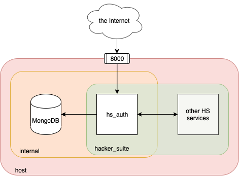

# Hacker Suite - Auth
[](https://travis-ci.org/unicsmcr/hs_auth)
[](https://codecov.io/gh/unicsmcr/hs_auth)


`hs_auth` is a service designed to provide user authentication/authorization and team functionalities for other Hacker Suite services. Its features include:
 - User registration and login
 - Teams
 - Email verification
 - Password reset
 - Multiple user authorization levels
 - Admin management for users and teams
 - Easy deployment via Docker which starts:
   - `hs_auth`
   - A MongoDB database
   - GUI MongoDB management tool - Mongo Express
   
[API Reference](https://documenter.getpostman.com/view/2489646/T1DjjKP6?version=latest#38b37cec-69a0-4445-aba4-fd72e5868876)

## Dependencies
### Docker deployment:
 - [GNU make](https://www.gnu.org/software/make/)
 - [Docker](https://www.docker.com/products/docker-desktop)
 - [docker-compose](https://docs.docker.com/compose/install/)

### Manual deployment
 - [Go](https://golang.org/)
 - MongoDB database

### Development and testing
 - [GNU make](https://www.gnu.org/software/make/)
 - [Docker](https://www.docker.com/products/docker-desktop)
 - [Go](https://golang.org/)
 - [mockgen](https://github.com/golang/mock)
 - [wire](https://github.com/google/wire/)
 - [refresh](https://github.com/markbates/refresh)

## Getting started

### Project setup

Make sure you have the required dependencies for your use case and run the following commands in a terminal:

```
go get github.com/unicsmcr/hs_auth
cd $GOROOT/src/github.com/unicsmcr/hs_auth
cp app.env.example app.env
cp mongo.env.example mongo.env                  // only needed for deployments with Docker
cp mongo_express.env.example mongo_express.env  // only needed for deployments with Docker
```

Then replace the placeholder values in the `.env` files

### Deployment

#### Deploying with Docker

***Production environment***

Run the following command in a terminal:
```
make up
```

This will set up infrastructure illustrated in the following picture:



It will set up 3 things:

1. Create 2 docker containers:
   - `hs_auth` - the `hs_auth` service
   - `mongo` - an instance of MongoDB to be used by `hs_auth`

2. Create 2 docker networks:
   - `internal` - for interactions between `hs_auth` and `mongo`. Ensures that only `hs_auth` can access the database used by the service
   - `hacker_suite` - for interactions between `hs_auth` and other Hacker Suite  services. Allows for an easier service discovery between Hacker Suite services running on the same host. For example: other services on the `hacker_suite` network can call `hs_auth` by using the hostname **hs_auth** rather than **localhost:8000**

3. Expose `hs_auth` to external calls through port **8000** on the host. Meaning services from outside of the `hacker_suite` network can call `hs_auth` through **localhost:8000**.

***Development environment***

**YOU SHOULD NEVER USE THIS WHEN DEALING WITH ACTUAL USER DATA**

Run the following command in a terminal:
```
make up-dev
```

This will set up infrastructure illustrated in the following picture:


It will set up 5 things:

1. Start `hs_auth` on port **8000** on the host. The app will also restart every time a code change is made
2. Create 2 docker containers:
   - `mongo` - an instance of MongoDB to be used by `hs_auth`
   - `mongo_express` - a web-based GUI for managing `mongo`
3. Expose `mongo_express` to port **8001** on the host.
4. Expose `mongo` to port **8002** on the host.
5. Create the docker network `internal`. Allows `mongo_express` to interact with `mongo`.

**Note**: in contrast with the production deployment process, `hs_auth` will not be started in a docker container. As such, it will not be available under the hostname **hs_auth** on the `hacker_suite` network, all calls to `hs_auth` will have to be made through **localhost:8000**.

***Accessing logs***

The docker deployment scripts will automatically detach logs from the terminal after a successful deployment (except for `hs_auth` logs when using `make up-dev`). There are multiple commands you can use to attach to the logs produced by any of the containers:
```
make logs         // will attach to logs from all of the docker containers
make logs-app     // will attach to the hs_auth logs if started with make up
make logs-db      // will attach to the MongoDB logs
```

***Stopping the app***

In order to stop `hs_auth` and its MongoDB database in both production and development environments, use the following command:
```
make down
```

**Note**: while this will shut down the MongoDB instance, it will not delete the data stored in the database.

***Clearing the database***

Both of the deployment scripts will create a directory in the repository's root called **data**. In order to clear the database, run `make down` then delete the **data** directory and restart the application.

#### Deploying without Docker

1. Make sure the environment variables in `app.env` point to a running MongoDB database.
2. Run `go run main.go wire_gen.go server.go`

## Development

### Dependency Injection

`hs_auth` uses [wire](https://github.com/google/wire) for dependency injection. Whenever you want to add a new dependency to the DI container, add its builder method to `wire.go`, run the command `wire` in a terminal and restart the application.

### Tests

***Unit tests***

Unit tests can be run with:
````
make test
````

***Integration tests***

Integration tests can be run with:
````
make test-integration
````

Currently `hs_auth` supports:
 - Integration tests for interactions between `hs_auth` and the MongoDB database

Running the integration tests will start:
 - A MongoDB database

### Mocks

Mocks for all public interfaces can be automatically generated by running: 
```
make mocks
```
It will scan the repository for public interfaces and generate their mocks under the directory **mocks**.

No mocking functionality for structs is currently supported.


## License

Hacker Suite - Auth is licensed under the MIT License.
